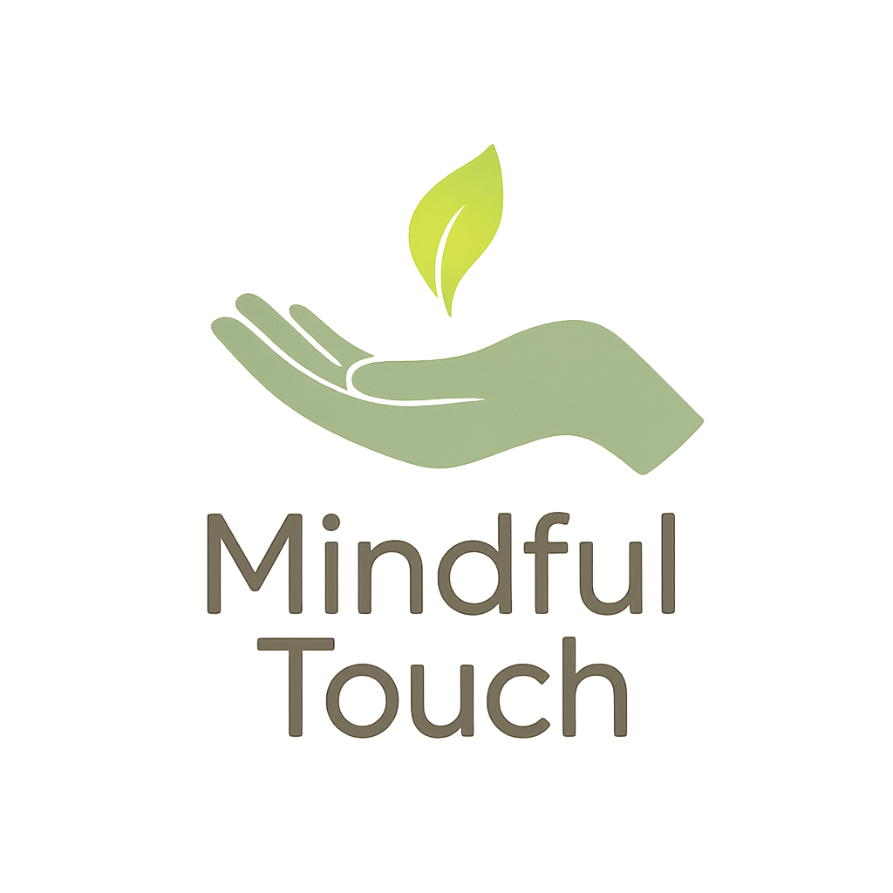

# Mindful Touch

A gentle awareness tool for mindful hand movement tracking.

<p align="center">
  
</p>

Mindful Touch helps you become more aware of unconscious face-touching habits by providing gentle, non-intrusive notifications when your hands approach specific facial regions. The application uses advanced multi-region detection to identify contact with areas like the scalp, eyebrows, eyes, mouth, and beard area.

## 🌟 Features

- **Multi-region detection**: Monitors specific facial regions (scalp, eyebrows, eyes, mouth, beard)
- **Real-time visualization**: Live camera feed with detection overlays
- **Gentle notifications**: Provides calm, non-judgmental reminders
- **Privacy-first**: All processing happens locally on your device
- **Customizable regions**: Enable/disable specific detection areas
- **Cross-platform**: Works on Windows, macOS, and Linux

## 📋 Requirements

- Python 3.8 or newer
- Webcam
- Operating System: Windows, macOS, or Linux

## 🔧 Installation

### Clone the repository
```bash
git clone https://github.com/maniatisni/mindful-touch.git
cd mindful-touch
```

### Install dependencies
```bash
pip install -r requirements.txt
```

## 🚀 Quick Start

To start the multi-region detection application:

```bash
python -m mindful_touch
```

## 🎮 Controls

While the application is running, use these keyboard shortcuts:

- **q**: Quit the application
- **s**: Toggle scalp detection
- **e**: Toggle eyebrow detection
- **y**: Toggle eye detection
- **m**: Toggle mouth detection
- **b**: Toggle beard detection

## 🔧 Configuration

The application uses MediaPipe for accurate hand and face tracking. You can customize detection thresholds, region sensitivity, and visual settings by modifying the configuration parameters in the code.

## 🔒 Privacy Information

Mindful Touch is designed with privacy as a core principle:

- All processing happens locally on your device
- No images or data are sent to any server
- The application only uses your camera when running

## 📜 License

Mindful Touch is released under the MIT License. See the [LICENSE](LICENSE) file for details.

---

May your mindfulness journey be gentle and insightful. 🌸